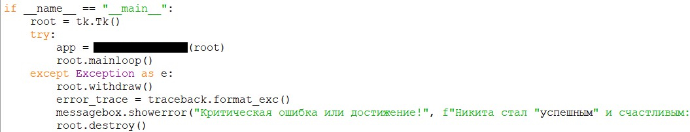

  <!-- Баннер -->
  

    

  <!-- Приветствие: шрифт Dancing Script, глубокий благородный зеленый цвет -->
  

    

  <!-- Девиз -->
  <h3 align="center" style="color: #1B4D3E;"><i>"Smartphones now, what's smarter later?"</i></h3>

   

  <!-- Стек технологий -->
  

    
    
    
    
    
      
    
    
    
    
    
    
  

    

  <!-- Статистика профиля: Светлая тема, темно-зеленый текст и иконки. ВАЖНО: замените YOUR_USERNAME на ваш никнейм -->
  

